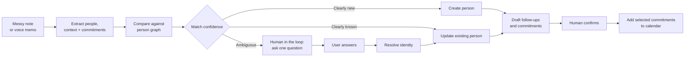
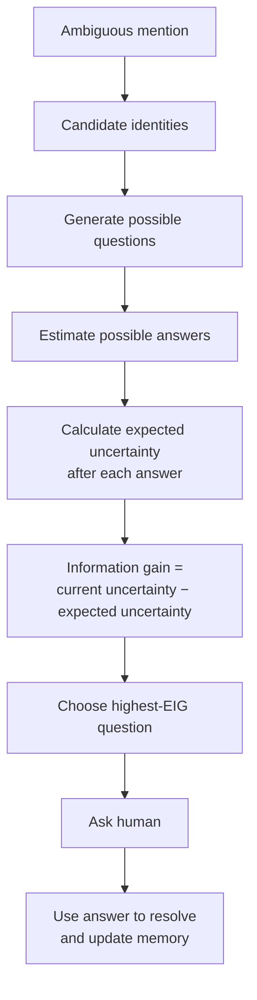

# Recall: The Question Worth Asking

## One-line mission

Recall turns messy human notes into reliable, usable memory about the people we meet.

## The problem

After an event, people remember conversations imperfectly:

> “I spoke to Wei from GIC, and later I met the Malaysian Chinese girl from the robotics lab.”

A rough note may be enough in the moment. But weeks later, the details are fragmented. You remember meeting someone, but not clearly enough to know who they were, what they did, or what you promised them.

This creates a practical business problem. Important relationships are lost, follow-ups are missed, and customer or contact records become incomplete or duplicated.

The problem becomes more serious when two people already in memory both fit the same description.

An AI system has two common choices:

- Guess, risking a wrong merge.
- Send every uncertain case to a human for manual review.

One corrupts the data. The other creates a growing administrative queue.

## The idea

Recall introduces a third option:

> Keep the uncertainty, identify the possible people, and ask the single question that will reduce the uncertainty the most.

Recall uses Expected Information Gain, or EIG, to select that question.

EIG measures how much uncertainty a question is expected to remove. A question that clearly separates two possible people has high information gain. A question where both people would give the same answer has low information gain.

For example:

- “Did you attend the same school?” may sound relevant, but it is almost useless if both candidates attended that school.
- “Did you live on the fourth floor?” is more useful if one candidate did and the other did not.

Recall calculates this value instead of asking a language model to produce a plausible-sounding question.

## How Recall works

A rough note, typed entry, or voice memo passes through six stages:

1. Extract meaningful mentions of people, roles, organisations, places, and commitments.
2. Compare each mention against the existing person graph.
3. Automatically resolve clear matches and clear new people.
4. Hold genuinely ambiguous matches instead of forcing a decision.
5. Ask one question selected for maximum expected information gain.
6. Apply the answer, update the correct record, and continue.



The human is not an emergency fallback. Human input is a deliberate control point in the workflow.

Recall handles routine cases automatically, but pauses when the cost of being wrong is greater than the cost of asking. The user’s answer determines which person record is updated. This keeps the system useful without allowing it to silently create false memories.

## The business use case

Networking is the first demonstration setting because it produces messy references naturally: partial names, vague descriptions, similar-sounding people, shared companies, and details remembered days later.

But the business value is broader than personal networking.

Recall addresses a recurring operational problem: people and organisations are often identified from incomplete, inconsistent, human-written information.

Potential applications include:

- customer relationship systems containing duplicate or incomplete records;
- sales teams connecting meeting notes to the correct account or contact;
- recruiters matching applicants who use different names or contact details;
- compliance teams reviewing name-matching alerts;
- support teams connecting conversations to the correct customer history;
- internal knowledge systems resolving people across emails, notes, and documents.

In each case, the cost of a wrong merge is high. It can attach the wrong employer, commitments, financial information, or interaction history to someone’s record.

The cost of asking a human is also real. Every unnecessary question consumes attention and slows the workflow.

Recall creates value in two ways:

1. It protects the quality of business data by avoiding unsafe merges.
2. It reduces the amount of human attention required to resolve ambiguous cases.

The networking experience is simply the most relatable way to show the underlying capability.

## What makes it different

Existing memory systems focus mainly on storing information, retrieving it, and detecting contradictions. Recall focuses on a different decision:

> When memory is uncertain, which clarification should the system request before it writes?

The system does not ask a model to improvise a question. It evaluates candidate questions against the evidence already stored and chooses the one most likely to distinguish the possible identities.



The result is not maximum automation. It is selective automation:

> Ask only when the answer matters, and ask the question most likely to settle the case.

## How we measure it

Recall evaluates whether references across multiple memos were correctly grouped under the right person.

For this, it uses B³ F1, pronounced “B-cubed F-one.” This is a standard entity-resolution score:

- B³ precision measures how often its groupings are correct.
- B³ recall measures how many correct relationships it successfully finds.
- B³ F1 combines both into one score.

In plain language, B³ F1 answers:

> Did Recall recognise mentions of the same person as belonging together, while keeping different people separate?

Recall also measures how much user effort is required to resolve ambiguity.

## Evidence

The current benchmark contains:

- 114 memos;
- 234 mentions;
- 83 recurring people;
- 11 scenarios;
- B³ F1 of 0.911 ± 0.121;
- precision of 1.000 on all five professional-setting fixtures;
- 411 automated tests, all runnable offline with no credentials or paid model calls.

For question selection, Recall is compared against random selection and uncertainty-first selection. Across approximately 69 scorable cases over three runs:

```text
Expected information gain: 0.862 questions per resolution
Uncertainty-first:          1.033 questions per resolution
Random:                     1.129 questions per resolution
```

Lower is better. Recall also completed 78% of cases with at most one question, compared with 75% for uncertainty-first and 69% for random selection.

These measurements show two things:

1. Recall protects the quality of the person graph.
2. When clarification is necessary, it spends the user’s attention selectively.

## Why the benefit matters

A missed match is inconvenient.

A wrong merge is expensive.

Once two people are incorrectly combined, every later summary, reminder, follow-up, and AI action can be based on false context. The system becomes more confident while becoming less correct.

Recall is designed to fail in the safer direction:

> When confidence is insufficient, it asks before it writes.

The goal is not to automate every decision. The goal is to preserve reliable data while asking humans for help only when their answer can materially change the outcome.

## Conclusion

Recall is a voice-first interface for a broader business capability:

> resolving ambiguous human references before they become permanent data.

The networking scenario makes the problem familiar. The technical contribution is the mechanism underneath: preserve uncertainty, calculate the value of possible clarifications, ask one useful question, and use the answer to update the correct record.

Recall does not replace human judgment. It makes human judgment more valuable by requesting it only when it matters.
